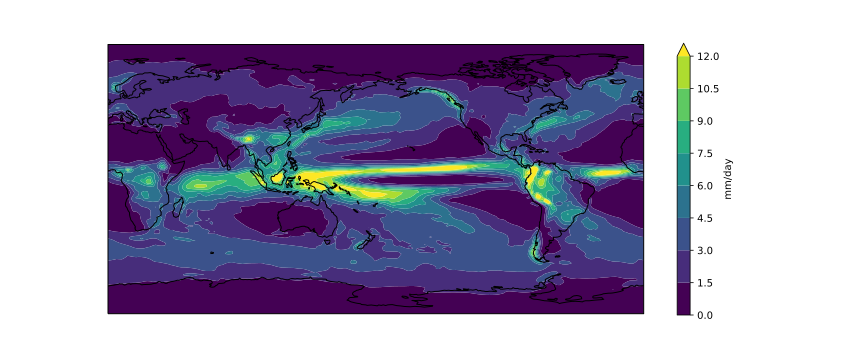
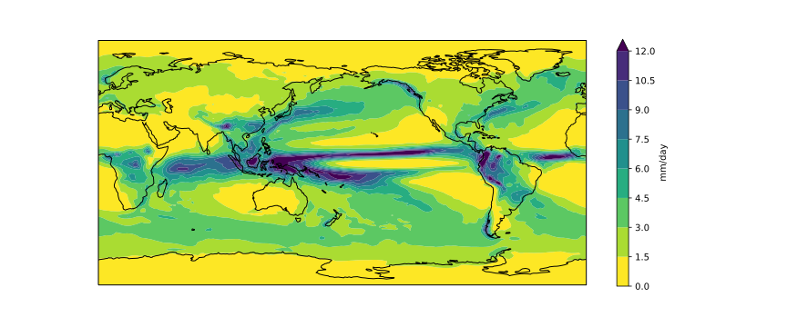

As a first step towards making a visual comparison of the
CSIRO-Mk3-6-0 and ACCESS1-3 historical precipitation climatology,
we are going to create a quick plot of the ACCESS1-3 data. 
~~~
access_pr_file = 'data/pr_Amon_ACCESS1-3_historical_r1i1p1_200101-200512.nc'
~~~
{: .language-python}

We are going to use the Met Office's [iris](http://scitools.org.uk/iris/) library,
which has been specifically written with the analysis of CMIP data in mind.
~~~
import iris
iris.FUTURE.netcdf_promote = True
import iris.plot as iplt
import matplotlib.pyplot as plt
import numpy
~~~
{: .language-python}

Since CMIP data files can be very large,
when you first "load" a data file in iris it simply loads the metadata
(i.e. the netCDF file attributes).
You can then view summary information about the contents of the file
and select a particular subset of the data before actually loading it into memory. 

~~~
cube = iris.load_cube(access_pr_file, 'precipitation_flux')
~~~
{: .language-python}

The particular object that gets created is an Iris cube:
~~~
type(cube)
~~~
{: .language-python}

~~~
iris.cube.Cube
~~~
{: .output}

~~~
print(cube)
~~~
{: .language-python}

~~~
precipitation_flux / (kg m-2 s-1)   (time: 60; latitude: 145; longitude: 192)
     Dimension coordinates:
          time                           x             -               -
          latitude                       -             x               -
          longitude                      -             -               x
     Attributes:
          CDI: Climate Data Interface version 1.7.1 (http://mpimet.mpg.de/cdi)
          CDO: Climate Data Operators version 1.7.1 (http://mpimet.mpg.de/cdo)
          Conventions: CF-1.4
          NCO: 4.7.0
          associated_files: baseURL: http://cmip-pcmdi.llnl.gov/CMIP5/dataLocation gridspecFile: gridspec_atmos_fx_ACCESS1-3_historical_r0i0p0.nc...
          branch_time: 90945.0
          cmor_version: 2.8.0
          comment: at surface; includes both liquid and solid phases from all types of clouds...
          contact: The ACCESS wiki: http://wiki.csiro.au/confluence/display/ACCESS/Home. Contact...
          creation_date: 2012-02-08T06:45:54Z
          experiment: historical
          experiment_id: historical
          forcing: GHG, Oz, SA, Sl, Vl, BC, OC, (GHG = CO2, N2O, CH4, CFC11, CFC12, CFC113,...
          frequency: mon
          history: Fri Dec  8 10:05:47 2017: ncatted -O -a history,pr,d,, pr_Amon_ACCESS1-3_historical_r1i1p1_200101-200512.nc
Fri...
          initialization_method: 1
          institute_id: CSIRO-BOM
          institution: CSIRO (Commonwealth Scientific and Industrial Research Organisation, Australia),...
          model_id: ACCESS1.3
          modeling_realm: atmos
          parent_experiment: pre-industrial control
          parent_experiment_id: piControl
          parent_experiment_rip: r1i1p1
          physics_version: 1
          product: output
          project_id: CMIP5
          realization: 1
          references: See http://wiki.csiro.au/confluence/display/ACCESS/ACCESS+Publications
          source: ACCESS1-3 2011. Atmosphere: AGCM v1.0 (N96 grid-point, 1.875 degrees EW...
          table_id: Table Amon (27 April 2011) 9c851218e3842df9a62ef38b1e2575bb
          title: ACCESS1-3 model output prepared for CMIP5 historical
          tracking_id: 26bfc8da-78ff-4b10-9e13-24492c09bb59
          version_number: v20120413
     Cell methods:
          mean: time
~~~
{: .output}

In this case the file isn't very large (five years worth of monthly data),
so we can load it all into memory and convert the units from
kg m-2 s-1 to mm day-1.

To do this, consider that
1 kg of rain water spread over 1 m2 of surface is 1 mm in thickness
and that there are 86400 seconds in one day.
Therefore, 1 kg m-2 s-1 = 86400 mm day-1.

~~~
type(cube.data)
~~~
{: .language-python}

~~~
numpy.ndarray
~~~
{: .output}

~~~
cube.data = cube.data * 86400
cube.units = 'mm/day'

print(cube)
~~~
{: .language-python}

~~~
precipitation_flux / (mm/day)       (time: 60; latitude: 145; longitude: 192)
...
~~~
{: .output}

To calculate the climatology, we can make use of the fact that Iris cubes have
[built in functionality](http://scitools.org.uk/iris/docs/latest/userguide/cube_statistics.html#collapsing-entire-data-dimensions)
for collapsing their dimensions.

~~~
clim = cube.collapsed('time', iris.analysis.MEAN)

print(clim)
~~~
{: .language-python}

~~~
precipitation_flux / (mm/day)       (latitude: 145; longitude: 192)
     Dimension coordinates:
          latitude                           x               -
          longitude                          -               x
     Scalar coordinates:
          time: 2003-07-03 00:00:00, bound=(2001-01-01 00:00:00, 2006-01-01 00:00:00)
...
~~~
{: .output}

The new climatology cube retains all relevant metadata (e.g. latitude and longitude details),
which the `iris.plot` function uses to generate a plot
in far fewer lines of code than would be required using `matplotlib.pyplot`
(i.e. they've built `iris.plot` on top of `matplotlib.pyplot`,
to make data visualisation much quicker and easier).

> ## Magics
>
> IPython (and hence the Jupyter notebook) come with a whole bunch of built in
> [magic commands](http://ipython.readthedocs.io/en/stable/interactive/magics.html).
> Use the built in `%matplotlib inline` magic command to make plots appear
> in the notebook rather than in a separate window.
>
{: .callout}

~~~
%matplotlib inline
~~~
{: .language-python}

~~~
fig = plt.figure(figsize=[12,5])
iplt.contourf(clim, levels=numpy.arange(0, 10), extend='max')
plt.gca().coastlines()
cbar = plt.colorbar()
cbar.set_label(str(cube.units))
plt.show()
~~~
{: .language-python}

The default colorbar used by matplotlib is `viridis`.
It used to be `jet`,
but that was changed a couple of years ago in response to the 
[#endtherainbow](https://www.climate-lab-book.ac.uk/2014/end-of-the-rainbow/) campaign.

Putting all the code together
(and reversing viridis so that wet is purple and dry is yellow)...

~~~
import iris
iris.FUTURE.netcdf_promote = True
import matplotlib.pyplot as plt
import iris.plot as iplt
import numpy

access_pr_file = 'data/pr_Amon_ACCESS1-3_historical_r1i1p1_200101-200512.nc'

cube = iris.load_cube(access_pr_file, 'precipitation_flux')

cube.data = cube.data * 86400
cube.units = 'mm/day'

clim = cube.collapsed('time', iris.analysis.MEAN)

fig = plt.figure(figsize=[12,5])
iplt.contourf(clim, cmap='viridis_r', levels=numpy.arange(0, 10), extend='max')
plt.gca().coastlines()
cbar = plt.colorbar()
cbar.set_label(str(cube.units))

plt.show()
~~~
{: .language-python}

> ## Month selection
>
> Copy and paste the final slab of code above into your own Jupyter notebook.
>
> After the line that uses the `iris.load_cube` function,
> add a couple of lines of code to extract the data for the month of June.
>
> (Hint: Use the [iris.coord_categorisation](http://scitools.org.uk/iris/docs/latest/iris/iris/coord_categorisation.html)
> function to add a month coordinate to the cube,
> then use the [extract functionality](http://scitools.org.uk/iris/docs/latest/userguide/subsetting_a_cube.html#cube-extraction)
> with a month-based constraint.)
> 
> > ## Solution
> > ~~~
> > cube = iris.load_cube(access_pr_file, 'precipitation_flux')
> > iris.coord_categorisation.add_month(cube, 'time')
> > cube = cube.extract(iris.Constraint(month='Jun'))
> > ~~~
> > {: .language-python}
> {: .solution}
{: .challenge}

> ## Add a title
>
> Add a title to the plot which gives the name of the model
> (taken from the cube attributes)
> followed by the words "precipitation climatology (Jun)"
>
> > ## Solution
> > ~~~
> > title = '%s precipitation climatology (Jun)' %(cube.attributes['model_id'])
> > plt.title(title)
> > ~~~
> > {: .language-python}
> {: .solution}
{: .challenge}

> ## Color palette
>
> The viridis color palette doesn't seem quite right for rainfall.
> Change it to the [cmocean](http://matplotlib.org/cmocean/) palette
> used for ocean salinity data.
>
> > ## Solution
> > ~~~
> > iplt.contourf(clim, cmap=cmocean.cm.haline_r, levels=numpy.arange(0, 10), extend='max')
> > ~~~
> > {: .language-python}
> {: .solution}
{: .challenge} 